# Script PlayOnLinux per Gestione Stand Gastronomico 
gestionestandgastronomico.it è un software di Emanuele Gesuato usato per la gestione delle sagre di paese

Eseguendo in PlayOnLinux lo script ```gestionestandgastronomico.sh``` da "Strumenti" -> "Esegui uno script" su PlayOnLinux (o PlayOnMac se si usa MacOS) sarà possibile eseguire il software di gestione delle sagre senza dover avere Windows come sistema operativo.

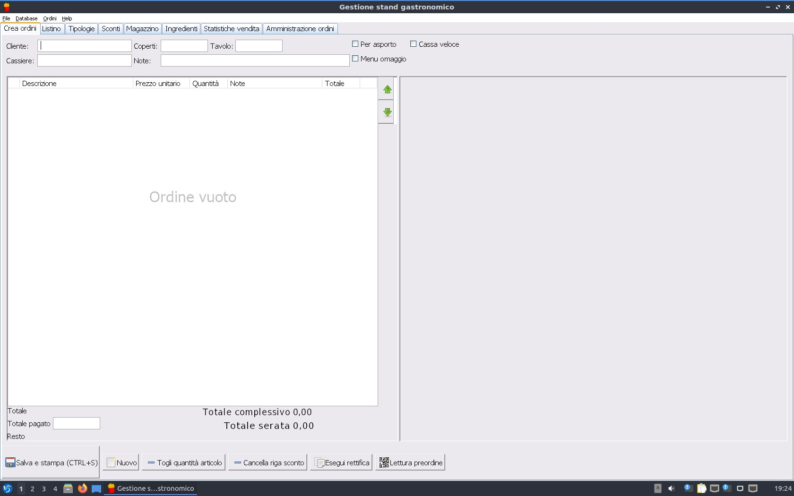

# Come posso installarlo?
Puoi installare seguendo pochi semplici passaggi:
1. Installa PlayOnLinux o PlayOnMac
2. Scarica il file [gestionestandgastronomico.sh](https://github.com/MatteoGheza/gestionestandgastronomico-playonlinux/blob/master/gestionestandgastronomico.sh) con tasto destro -> salva con nome
3. Apri PlayOnLinux (o PlayOnMac)  
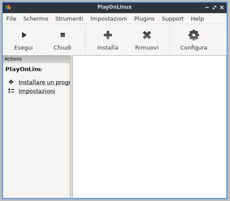
4. Andare su "Strumenti" e poi su "Esegui uno script"  
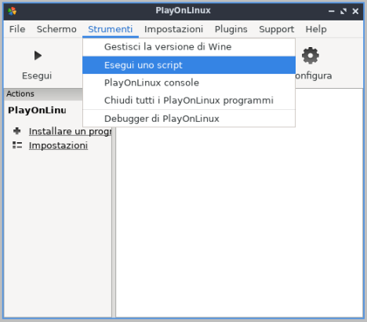
5. Si aprirà una nuova finestra. Bisogna premere su "Avanti"  
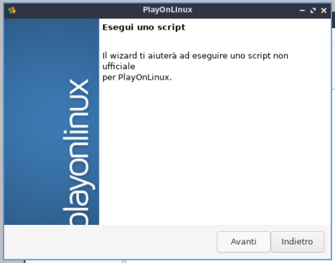
5. Nella successiva schermata, premere su "Esplora" e selezionare il file ```gestionestandgastronomico.sh``` precedentemente scaricato.  
Successivamente, premere su "Avanti"  

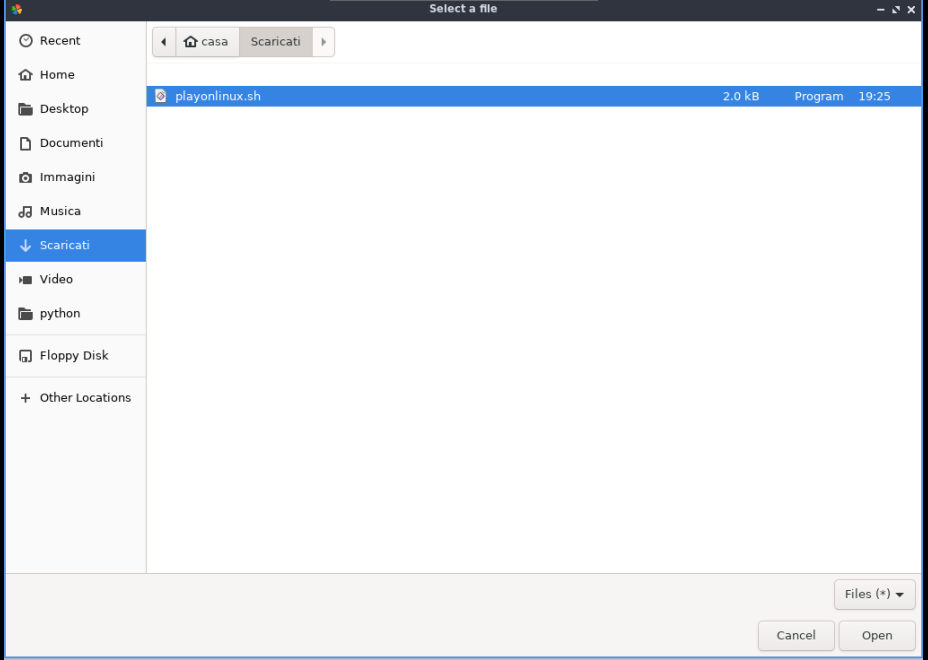
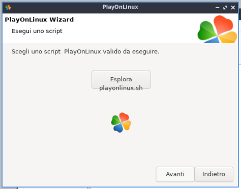
6. Si aprirà una nuova finestra, in cui si verrà avvertiti che lo script non è verificato.  
Questo perché il file non è ancora stato verificato dagli sviluppatori di PlayOnLinux.  
Nonostante questo avvertimento totalmente automatico, lo script è sicuro; visualizzare la risposta alla domanda _Questo script è sicuro?_ nella sezione "Domande Frequenti.
E' necessario confermare l'uso dello script anche nella successiva schermata, selezionando la checkbox.  
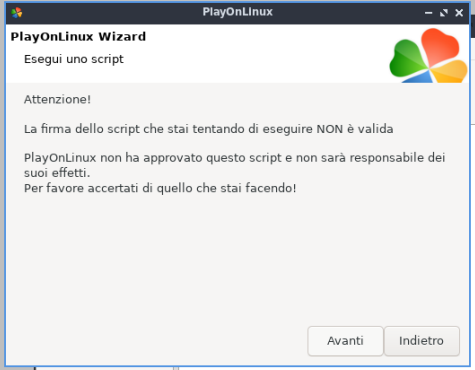

7. Ora è iniziata l'installazione vera e propria. Premere su "Avanti"  
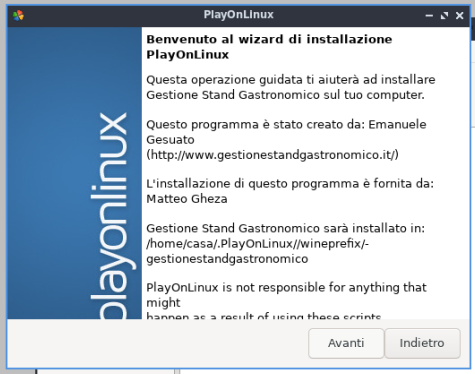
8. Selezionare "Scaricando il programma" e premere su "Avanti"  
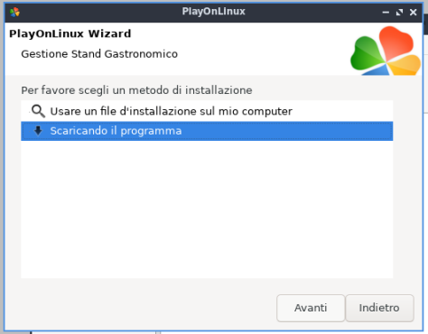
9. Adesso l'installazione dovrebbe proseguire automaticamente. Attendere la chiusura delle finistre dell'installazione.  
Se l'installazione è terminata correttamente, dovrebbe essere visibile la seguente schermata:  
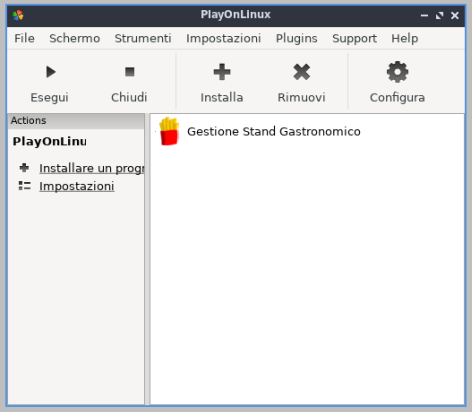
10. Selezionare "Gestione Stand Gastronomico" e premere su "Avvia"  
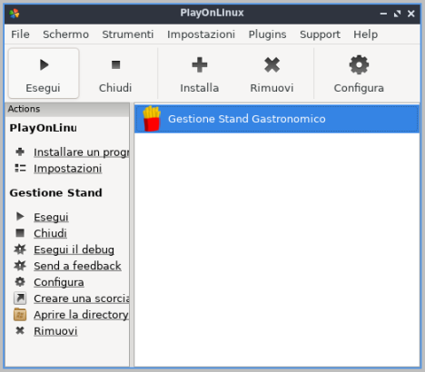
11. Ottimo, ora puoi utilizzare Gestione Stand Gastronomico da Linux/MacOS

# Domande Frequenti
## Il software è utilizzabile per una sagra vera? Ci sono delle funzionalità che non funzionano?
Attualmente funziona tutto al 100%, dalla stampa al server web, dall'esportazione alla gestione dell'inventario.  
Non è stato testato in una vera sagra, ma è stato provato per un'ora in una "finta serata", con un ottimo risultato.  
Non ho riscontrato problemi legati alle performance, che mi sono sembrate identiche a quelle riscontrate nella versione per Windows.  
Attualmente, è stato testato solo su Lubuntu, ma dovrebbe funzionare su ogni distro, variante o sistema operativo conpatibile con [PlayOnLinux](https://www.playonlinux.com/en/download.html)